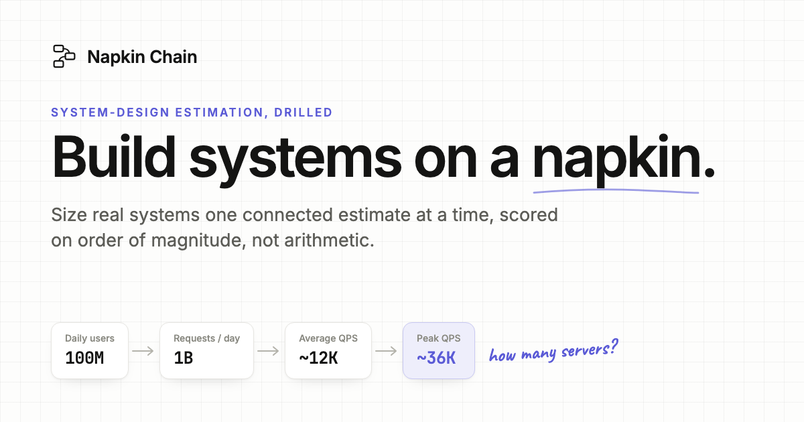
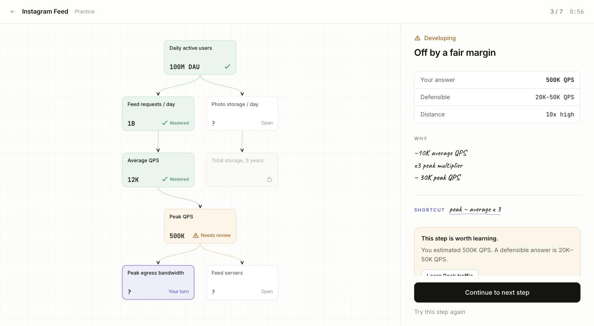
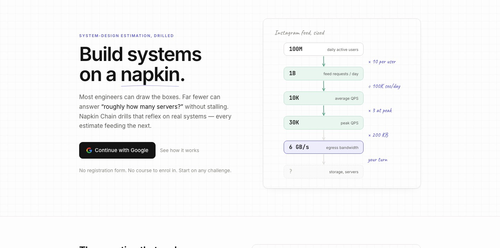
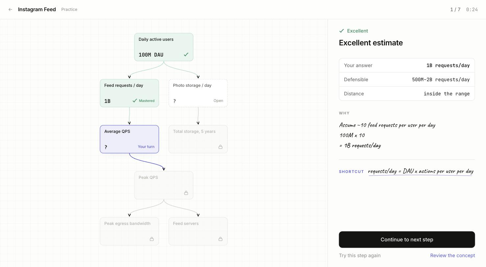
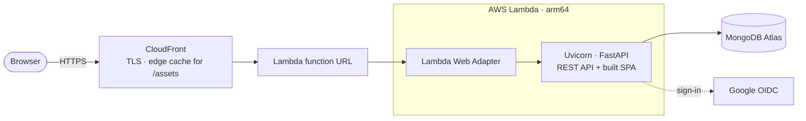

<div align="center">



<h1>Napkin Chain</h1>

<p><strong>A system-design estimation trainer. Size real systems one connected estimate at a time,<br/>scored on order of magnitude, not arithmetic.</strong></p>

<p>
  <a href="https://napkinchain.leadbybuild.ing"></a>
  
  
  
  
  
  
</p>

<p>
  <a href="https://napkinchain.leadbybuild.ing"><strong>Try it live</strong></a> ·
  <a href="#how-it-works">How it works</a> ·
  <a href="#architecture">Architecture</a> ·
  <a href="#engineering-decisions">Engineering decisions</a> ·
  <a href="#running-locally">Run it locally</a>
</p>

</div>

---

## The problem

Most engineers can draw the boxes in a system design: the load balancer, the
cache, the sharded database. Far fewer can answer the follow-up, *"roughly how
many servers does this need at peak?"*, without stalling.

That follow-up is arithmetic under pressure. It's a separate skill, and almost
nobody practises it deliberately. Quiz-style tools test single facts in
isolation. Real estimation is a **chain**, where every number you produce
becomes the input to the next:

```
100M DAU → 1B requests/day → ~12K QPS → ~36K peak QPS → bandwidth → storage → servers
```

Napkin Chain trains that chain directly.

## How it works



1. **Pick a real system.** Each challenge (an Instagram feed, a chat system,
   a URL shortener) is a directed graph of estimates, drawn as a napkin sketch.
2. **Estimate one node at a time.** Type answers the way you would say them
   (`12K`, `1.5B`, `3e8`). Each answer unlocks the nodes that depend on it.
3. **Get scored on magnitude.** Answers are judged by how many times away from
   a defensible range they land, not by exact arithmetic. Each answer comes
   with the reasoning and a reusable shortcut (`peak ≈ average × 3`).
4. **Learn exactly what you missed.** A miss links to the one concept behind
   it, then returns you to the step you left. Mastery is tracked per concept
   across every challenge.

| Distance from the defensible range | Result |
| --- | --- |
| within 1.5× | Excellent |
| within 2× | Very good |
| within 5× | Good |
| within 10× | Developing |
| beyond 10× | Needs review |

Thresholds can be configured per challenge and per node.

<table>
  <tr>
    <td width="50%"></td>
    <td width="50%"></td>
  </tr>
  <tr>
    <td align="center"><sub>Landing page</sub></td>
    <td align="center"><sub>Feedback on an excellent estimate</sub></td>
  </tr>
</table>

## Tech stack

| Layer | Technology |
| --- | --- |
| Frontend | React 19, TypeScript, Vite, Tailwind CSS 4, TanStack Query, Zustand, React Router |
| Backend | Python 3.13, FastAPI, Pydantic 2, Motor (async MongoDB driver) |
| Data | MongoDB Atlas |
| Auth | Google OpenID Connect (server-side code flow), signed `HttpOnly` session cookie, CSRF tokens |
| Hosting | AWS Lambda (arm64) with the Lambda Web Adapter, CloudFront, ACM |
| Quality | pytest (73 tests), Vitest and Testing Library (28 tests), oxlint, strict TypeScript |

## Architecture



The API and the single-page app are served from **one origin**, so there's no
CORS and the session cookie stays first-party (see
[Engineering decisions](#engineering-decisions)).

The backend keeps three concerns apart, because each changes at a different speed:

| Concern | Owner | Collections |
| --- | --- | --- |
| What a challenge **is** | `seed/`, `models/challenge.py` | `challenges`, `concepts` |
| What the user **did** | `services/attempt_service.py` | `challenge_attempts`, `node_attempts` |
| What the user **knows** | `services/mastery_service.py` | `concept_progress` |

```
backend/app/
  api/        thin route handlers
  services/   business logic; evaluation and mastery are pure functions
  models/     Pydantic documents, each carrying an explicit schemaVersion
  schemas/    API view models (camelCase over the wire)
  db/         connection management and deliberate indexes
  core/       config, security, structured JSON logging
  seed/       challenge and concept content, validated on load

frontend/src/
  routes/                one file per screen
  components/chain/      the napkin: DAG layout, canvas, mobile strip and sheet
  components/workspace/  estimate input and feedback panels
  components/napkin/     hand-drawn marks and handwritten notes
  lib/                   API client, number parsing and formatting
  stores/                unsent drafts (localStorage-backed)
```

## Engineering decisions

- **Scoring is server-authoritative.** The client never submits a score,
  ratio or mastery value; the server computes all of them. Expected answers
  aren't sent to the browser until that node has been attempted, so the
  answer key can't be read from network traffic.
- **The core logic is pure functions.** Evaluation and mastery have no I/O, so
  they're tested directly, without mocks. The mastery model can be replaced
  without touching its callers.
- **One origin, on purpose.** Hosting the SPA and the API on sibling hosts
  under a public-suffix domain (such as `*.onrender.com`) makes the session
  cookie third-party, and Safari blocks it outright. Serving both from one
  origin keeps `SameSite=Lax` cookies, needs no CORS, and leaves one thing to
  deploy.
- **It costs almost nothing to run.** The app runs unchanged on Lambda through
  the Lambda Web Adapter, so there's no handler rewrite and no framework
  lock-in. At this scale, Lambda and CloudFront both stay inside their
  always-free tiers. Hashed static assets are cached at the edge and never
  invoke Lambda.
- **Deploys don't need Docker.** `deploy/aws/deploy.sh` builds the SPA, pulls
  Linux arm64 wheels with pip's cross-platform flags, and ships a 17 MB zip.
  A multi-stage `Dockerfile` is still maintained, so the same app runs on any
  container host.
- **Content is data, not code.** Challenges are graphs defined in seed files,
  validated against Pydantic models, and loaded idempotently. Adding a system
  needs no schema change and no migration.
- **Every document is versioned.** Each stored document carries a
  `schemaVersion`, so its shape can evolve without a flag day.

## Security

- Google identity is verified server-side against Google's JWKS. The OAuth
  access token is discarded as soon as the identity is confirmed, and only the
  `openid`, `email` and `profile` scopes are requested.
- Sessions are short-lived signed JWTs in `HttpOnly`, `Secure`, `SameSite=Lax`
  cookies. Every state-changing request also needs a double-submit CSRF token.
- Every user-scoped query is filtered by the session's user ID. A `userId` sent
  in a request body is ignored.
- Auth and submission endpoints are rate limited per client.
- Secrets live only in the runtime environment. Nothing sensitive is committed.

## Running locally

**Prerequisites:** Node 20+, Python 3.12+, and a MongoDB connection string
(a local `mongod` or a free Atlas cluster).

```bash
# Backend
cd backend
python -m venv .venv && source .venv/bin/activate
pip install -r requirements.txt
cp .env.example .env            # set MONGODB_URI at minimum
uvicorn app.main:app --reload   # seeds content and creates indexes on startup
```

```bash
# Frontend (in a second terminal)
cd frontend
npm install
npm run dev                     # http://localhost:5173
```

Vite proxies `/api` to the backend, so development uses a single origin just as
production does. With `ENVIRONMENT=local` the sign-in screen offers a
development login that needs no Google credentials. The endpoint behind it
returns 404 in every other environment. Interactive API docs are at
`http://localhost:8000/docs`.

## Testing

```bash
cd backend && .venv/bin/python -m pytest   # 73 tests
cd frontend && npm test                    # 28 tests
```

The backend suite covers the evaluation engine, mastery scoring,
authorization boundaries and Google identity checks. It also runs the full
challenge flow end to end against a real database (skipped when none is
reachable). The frontend suite covers estimate parsing, chain layout, the
input and feedback panels, and the workspace's fail → learn → retry loop.

## Deployment

Production runs at **[napkinchain.leadbybuild.ing](https://napkinchain.leadbybuild.ing)**
on AWS Lambda behind CloudFront.

```bash
deploy/aws/deploy.sh          # build the SPA, bundle arm64 wheels, update the function
deploy/aws/deploy.sh --build  # build the bundle only
```

Runtime configuration (`MONGODB_URI`, `GOOGLE_CLIENT_ID`,
`GOOGLE_CLIENT_SECRET`, `SESSION_SECRET`, `FRONTEND_URL`, `BACKEND_URL`) lives
in the function's environment and is never touched by the deploy script.
CloudFront must forward every viewer header except `Host`
(`AllViewerExceptHostHeader`), because a function URL rejects requests whose
`Host` isn't its own.

Google sign-in needs `<public URL>/api/auth/google/callback` registered as an
authorized redirect URI on a Web OAuth client. Atlas needs network access from
`0.0.0.0/0`, because Lambda has no fixed egress IP. Access is controlled by the
database credentials.

<details>
<summary>Alternative: a single container (Render, Fly.io, ECS, …)</summary>

The root `Dockerfile` builds the SPA with Node 22, then serves it and the API
from a slim Python 3.13 image running as a non-root user. `render.yaml` deploys
it as one Render web service. On Render, the public URL is read from
`RENDER_EXTERNAL_URL` at runtime. Elsewhere, set `FRONTEND_URL` and
`BACKEND_URL`.

</details>

**Health checks:** `GET /health` reports liveness and never touches the
database. `GET /health/db` reports database reachability separately.

## Roadmap

- [x] Chain workspace, magnitude scoring, concept library and per-concept mastery
- [x] URL shortener, chat system and Instagram feed challenges
- [ ] Rate limiter, notification system, image hosting, YouTube, WhatsApp,
      video streaming and observability platform challenges
- [ ] Move index creation and seeding out of cold start into the deploy step
- [ ] Shared rate-limit store for multi-instance deployments

---

<div align="center">
<sub>Built by <a href="https://github.com/danivijay">@danivijay</a></sub>
</div>
